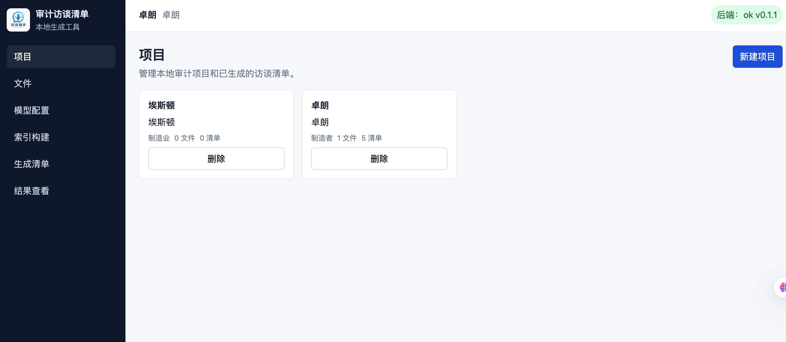

# 审计访谈清单生成工具

一款**本地优先**的审计访谈清单桌面应用。审计师上传制度文件后，应用会自动完成解析、切片、向量化与检索，并基于制度证据一键生成「访谈问题 / 制度依据答案 / 风险提示 / 制度缺失项」，大幅压缩访谈准备时间。

## 项目概览


应用以「项目」为基本单位管理所有审计资料：每个项目独立隔离其制度文件、索引、清单与导出结果，方便多任务并行开展。

## 核心功能

### 1. 多格式文件上传

支持 **PDF / DOCX / XLSX / TXT / CSV / Markdown** 等常见制度文档，自动解析文本与结构，并保存在本地的「上传文件保存位置」。



解析过程中实时显示状态（`parsed` / `failed` 等），并对失败文件给出错误原因，便于追溯。

### 2. 模型配置与本地降级

- 支持 **OpenAI-compatible** 推理模型与向量模型的在线接入。
- 未配置 API Key 时，自动切换至**本地确定性向量 + 模板生成**模式，可完整跑通「上传 → 解析 → 切片 → 检索 → 生成 → 导出」全链路，方便离线试用与样例验证。

### 3. 索引构建

对上传文件执行**切片、向量化与持久化**，生成可用于语义检索的本地索引。解析、切片、向量化和清单生成全过程都会写入任务进度日志，前端实时显示进度条与最近任务状态。

### 4. 访谈清单生成

基于已构建的索引，结合目标行业 / 制度主题，生成结构化的访谈问题清单，包括：

- 访谈问题
- 制度依据答案（含原文片段溯源）
- 风险提示
- 制度缺失项

### 5. 结果查看与多格式导出

生成的清单以表格形式呈现，支持按「模块 / 置信度」筛选，并可一键导出为 **Excel、Word、JSON**，方便交付与归档。


## 典型工作流

1. **新建项目** → 在「项目」页创建审计项目。
2. **上传制度文件** → 在「文件」页上传制度文档，等待解析完成。
3. **构建索引** → 在「索引构建」页对项目内文件执行切片与向量化。
4. **配置模型**（可选） → 在「模型配置」页接入推理 / 向量模型，或保持本地降级模式。
5. **生成清单** → 在「生成清单」页触发清单生成，实时查看任务进度。
6. **查看与导出** → 在「结果查看」页筛选问题、查看证据片段，并按需导出 Excel / Word / JSON。

## 本地运行

```bash
# 安装前端依赖
npm --prefix frontend install

# 安装后端依赖
python3 -m pip install -r backend-python/requirements.txt

# 启动后端
bash scripts/start_backend.sh

# 新开终端启动前端
npm --prefix frontend run dev
```

- 前端地址：`http://127.0.0.1:5173`
- 后端健康检查：`http://127.0.0.1:8765/health`

## 数据位置

运行时数据保存在 `backend-python/storage`，包括上传文件、SQLite 数据库和导出文件。该目录已加入 `.gitignore`，避免污染版本库。

## 适用场景

- 内部审计 / 外部审计的访谈准备阶段
- 合规检查中的制度对照与缺口识别
- 审计知识库沉淀与复用
